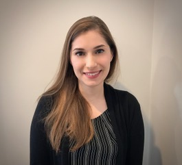

# Teaching Assistants

Most of this year's stellar group of teaching assistants has been in your shoes - they've taken the course in the past, and they enjoyed it enough to come back for more. They are volunteering their precious time and energy to help make the course happen, and we couldn't be more delighted to welcome you to the course. All office hours and all teaching assistant work will be done remotely.

There is a lot to learn in this class. Don't suffer in silence - talk to us! As mentioned earlier, **you shouldn't spend more than 15 minutes struggling with anything in this class without asking for help.**

Visit the [Getting Help with 432][Getting Help with 432] section of this Syllabus for more details.

The Spring 2021 Teaching Assistants for 432 are:

- [Stephanie Merlino Barr][Stephanie Merlino Barr], third year PhD student in Clinical Translational Science
- [Claudia Cabrera][Claudia Cabrera], second year PhD student in Biomedical \& Health Informatics
- [Lauren Cruz][Lauren Cruz], first year PhD student in Epidemiology \& Biostatistics
- [Daoyu Duan][Daoyu Duan], first year PhD student in Epidemiology \& Biostatistics
- [Guanqun (Leslie) Meng][Guanqun (Leslie) Meng], first year PhD student in Epidemiology \& Biostatistics 
- [Robert Schweickart][Robert Schweickart], recent MS graduate in Biology at CWRU transitioning into data science
- [Anastasia Vassiliou][Anastasia Vassiliou], second year MS student in Clinical Research
- [Siyu Wang][Siyu Wang], second year MS student in Biomedical Engineering

## Getting To Know The TAs

#### Stephanie Merlino Barr {-}

```{r Stephanie_fig, echo = FALSE, out.width = '20%'}
knitr::include_graphics("images/Stephanie_Merlino_Barr.jpg")
```

Stephanie Merlino Barr is a third year PhD student in the Clinical Translational Science program and a full-time dietitian in the Neonatal Intensive Care Unit (NICU) at MetroHealth Medical Center. Stephanie's research focuses on the relationship of early life nutrition interventions and long-term growth and developmental outcomes in very low birthweight infants. While Stephanie changed her undergraduate major to avoid a class with a programming requirement, she has immensely enjoyed learning R in 431 and 432. Stephanie has been using her R skills to create a database to assess nutrition-related outcomes for preterm infants in MetroHealth's NICU. In the pre-pandemic era, Stephanie enjoyed rowing, traveling, and attending concerts. Now, she spends her time hiking with her dog and making pasta.

#### Claudia Cabrera {-}

```{r Claudia_fig, echo = FALSE, out.width = '20%'}
knitr::include_graphics("images/Claudia_Cabrera.PNG")
```

Claudia Cabrera is an International Medical Graduate from Mexico. On 2019 she graduated from CWRU's MS Program in Clinical Research. Before coming to Case, Claudia worked in Bariatric Surgery for two years while also lecturing in Anatomy and Physiology at the same university from which she graduated in Mexico. She took 431 and 432 and TA'd for them during her MS program and thoroughly enjoyed learning Statistics, especially its applications to medicine. She is now in her second year as a Biomedical and Health Informatics PhD student at CWRU. Her area of research is otolaryngology - head and neck cancer using big data. In her free time, Claudia loves to explore Cleveland, especially by running and biking, and she also loves playing basketball and reading.

#### Lauren Cruz {-}

```{r Lauren_fig, echo = FALSE, out.width = '20%'}
knitr::include_graphics("images/Lauren_Cruz.jpg")
```

Lauren Cruz is a first year student in the PhD epidemiology and biostatistics program. She earned her MPH with a focus in population health at CWRU in Spring 2020. Lauren has a background in biological anthropology and is interested in genetic epidemiology and evolutionary development. When she's not studying, you can likely find her cooking, gardening, or cycling. As part of her Master's culminating experience, Lauren worked with Dr. Love through Better Health Partnership to evaluate a community healthcare outreach program involving a diverse patient population. She took 431/432 last cycle and is eager to work with this year's cohort to explore different ways to approach the key statistical concepts taught in this course series.

#### Daoyu Duan {-}

```{r Daoyu_fig, echo = FALSE, out.width = '20%'}
knitr::include_graphics("images/Daoyu_duan.jpg")
```

Daoyu Duan is a 1st year PhD student in Epidemiology & Biostatistics. I got my Bachelor degree in Math&Stats from UIUC and MS degree in Biostatistics from Columbia University. Before coming to CWRU, I have been working in a Pharmaceutical company called Regeneron for 2 years. My current research interest is sequencing data analysis. I enjoy video games, cooking and swimming most of the time.

#### Guanqun (Leslie) Meng {-}

```{r Leslie_fig, echo = FALSE, out.width = '20%'}
knitr::include_graphics("images/Leslie_Meng.jpg")
```

Leslie (Guanqun) Meng is a first year PhD student Epidemiology/Biostatistics program. He received his M.S degree in Biostatistics from Yale University in May 2020. He has been working extensively in RCTs and Observational Studies, with major focuses on building new survival models and deriving a novel propensity score weighting method. Leslie ran Marathon twice (4 hours), and now he is addicted to bodybuilding.

#### Robert Schweickart {-}

```{r Allen_fig, echo = FALSE, out.width = '20%'}
knitr::include_graphics("images/Allen_Schweickart.jpg")
```

Robert Schweickart has recently earned his Master's of Science degree here at CWRU and is looking to make the transition into data science. For his master's thesis, he analyzed cell migration in Drosophila. With the skills he learned in 431 and 432, he was able to model distinct characteristics of various genotypes and identify how they might influence migration. Robert's hobbies include bodybuilding, hiking, gaming, and trying not to burn the food he is cooking. Robert also answers to the name "Allen".

#### Anastasia Vassiliou {-}

```{r Anastasia_fig, echo = FALSE, out.width = '20%'}

```

Anastasia Vassiliou is in her second year in the M.S program in Clinical Research. She completed her bachelor's in Molecular Biology and Biotechnology. For her thesis she studied the role of Circulating Tumor Cells in cancer metastasis. Anastasia took 431 and 432 this past year and can't wait to apply the skills she learned in future research projects. Anastasia enjoys spending time with her family, cooking, reading, and hiking. 

#### Siyu Wang {-}

```{r Siyu_fig, echo = FALSE, out.width = '20%'}
knitr::include_graphics("images/Siyu_Wang.jpg")
```

Siyu Wang is in her second year in the M.S. program in Biomedical Engineering. She is an international student from China, and she completed her Bachelor's work in Biomedical Engineering in Shanghai Jiao Tong University. She has previously completed 431 and 432 coursework and learned many skills, which are very helpful for her project at Cleveland Clinic. Siyu likes cooking, reading, watching movies and photographing. 


